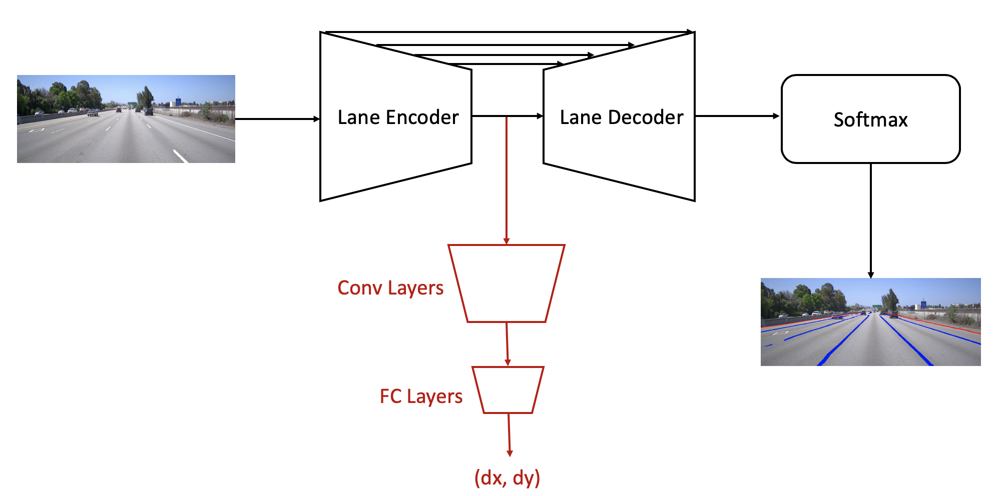

# Perception
Apollo 5.0
June 27, 2019

## Introduction

Apollo 5.0 Perception module introduced a few major features to provide diverse functionality, a more reliable platform and a more robust solution to enhance your AV performance. These include:

 * **Supports Caffe and PaddlePaddle**: [PaddlePaddle](https://github.com/PaddlePaddle/Paddle) (PArallel Distributed Deep LEarning) is an easy-to-use, efficient, flexible and scalable deep learning platform, which was originally developed by Baidu scientists and engineers for the purpose of applying deep learning to many products at Baidu.
 * **Online sensor calibration service**
 * **Manual camera calibration**
 * **Closest In-Path Object (CIPO) Detection**
 * **Vanishing Point Detection**

***Safety alert***

Apollo 5.0 *does not* support a high curvature road, roads without lane lines including local roads and intersections. The perception module is based on visual detection using a deep network with limited data. Therefore, before we release a better network, the driver should be careful while driving and always be ready to disengage the autonomous driving mode by intervening (hit the brakes or turn the steering wheel). While testing Apollo 3.0, please choose a path that has the necessary conditions mentioned above and be vigilant.

## Perception module
The flow chart of Apollo 5.0 Perception module:

To learn more about individual sub-modules, please visit [Perception - Apollo 3.0](./perception_apollo_3.0.md)

### Supports PaddlePaddle

The Apollo platform's perception module actively depended on Caffe for its modelling, but will now support PaddlePaddle, an open source platform developed by Baidu to support its various deep learning projects.
Some features include:
- **PCNNSeg**: Object detection from 128-channel lidar or a fusion of three 16-channel lidars using PaddlePaddle
- **PCameraDetector**: Object detection from a camera
- **PlaneDetector**: Lane line detection from a camera

#### Using PaddlePaddle Features

1. To use the PaddlePaddle model for Camera Obstacle Detector, set `camera_obstacle_perception_conf_file` to `obstacle_paddle.pt` in the following [configuration file](https://github.com/ApolloAuto/apollo/blob/master/modules/perception/production/conf/perception/camera/fusion_camera_detection_component.pb.txt)

2. To use the PaddlePaddle model for LiDAR Obstacle Detector, set `use_paddle` to `true` in the following [configuration file](https://github.com/ApolloAuto/apollo/blob/master/modules/perception/production/data/perception/lidar/models/cnnseg/velodyne128/cnnseg.conf)

### Online sensor calibration service

Apollo currently offers a robust calibration service to support your calibration requirements from LiDARs to IMU to Cameras. This service is currently being offered to select partners only. If you would like to learn more about the calibration service, please reach out to us via email: **apollopartner@baidu.com**

### Manual Camera Calibration

In Apollo 5.0, Perception launched a manual camera calibration tool for camera extrinsic parameters. This tool is simple, reliable and user-friendly. It comes equipped with a visualizer and the calibration can be performed using your keyboard. It helps to estimate the camera's orientation (pitch, yaw, roll). It provides a vanishing point, horizon, and top down view as guidelines. Users would need to change the 3 angles to align a horizon and make the lane lines parallel.

The process of manual calibration can be seen below:

### Closest In-Path Object (CIPO) Detection

The CIPO includes detection of key objects on the road for longitudinal control. It utilizes the object and ego-lane line detection output. It creates a virtual ego lane line using the vehicle's ego motion prediction. Any vehicle model including Sphere model, Bicycle model and 4-wheel tire model can be used for the ego motion prediction. Based on the vehicle model using the translation of velocity and angular velocity, the length and curvature of the pseudo lanes are determined.
Some examples of CIPO using Pseudo lane lines can be seen below:

1. CIPO used for curved roads

2. CIPO for a street with no lane lines

### Vanishing Point Detection

In Apollo 5.0, an additional branch of network is attached to the end of the lane encoder to detect the vanishing point. This branch is composed of convolutional layers and fully connected layers, where convolutional layers translate lane features for the vanishing point task and fully connected layers make a global summary of the whole image to output the vanishing point location. Instead of giving an output in `x`, `y` coordinate directly, the output of vanishing point is in the form of `dx`, `dy` which indicate its distances to the image center in `x`, `y` coordinates. The new branch of network is trained separately by using pre-trained lane features directly, where the model weights with respect to the lane line network is fixed. The Flow Diagram is included below, note that the red color denotes the flow of the vanishing point detection algorithm.

Two challenging visual examples of our vanishing point detection with lane network output are shown below:
1. Illustrates the case that vanishing point can be detected when there is obstacle blocking the view:

	

2. Illustrates the case of turning road with altitude changes:

	

#### Key Features

- Regression to `(dx, dy)` rather than `(x, y)` reduces the search space
- Additional convolution layer is needed for feature translation which casts CNN features for vanishing point purpose
- Fully Connected layer is applied for holistic spatial summary of information, which is required for vanishing point estimation
- The branch design supports diverse training strategies, e.g. fine tune pre-trained laneline model, only train the subnet with direct use of laneline features, co-train of multi-task network

## Output of Perception
The input of Planning and Control modules will be quite different with that of the previous Lidar-based system for Apollo 3.0.

- Lane line output
	- Polyline and/or a polynomial curve
	- Lane type by position: L1(next left lane line), L0(left lane line), R0(right lane line), R1(next right lane line)

- Object output
	- 3D rectangular cuboid
	- Relative velocity and direction
	- Type: CIPV, PIHP, others
	- Classification type: car, truck, bike, pedestrian
	- Drops: trajectory of an object

The world coordinate system is used as ego-coordinate in 3D where the rear center axle is an origin.

If you want to try our perception modules and their associated visualizer, please refer to the [following document](./how_to_run_perception_module_on_your_local_computer.md)

